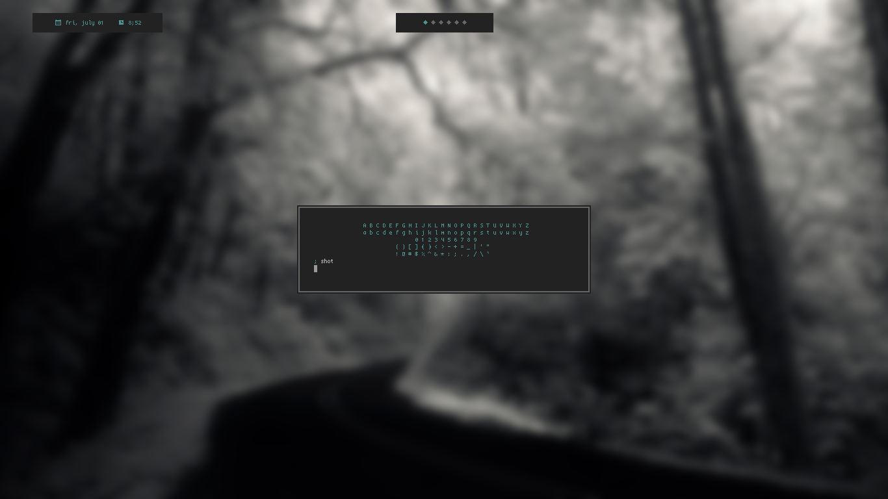
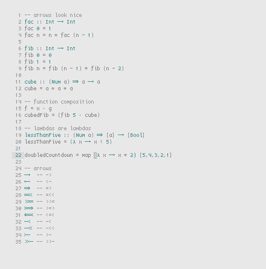

### haskell arrows

vim conceal + custom chars = nice haskell arrows.

drop the haskell-arrows.vim in ~/.vim/ftplugin/haskell/ and put

``
au Filetype haskell source ~/.vim/ftplugin/haskell/haskell.vim
``

in your .vimrc
